# Social Hackers Playlist

Computer technology related movies, series and documentaries

> ## FILMS
>
> > **Artificial Intelligence**

- [2001: A Space Odyssey](https://www.youtube.com/watch?v=m4WYPVipZpQ&list=PLawr1rgf_CvSiNsWPbLOOrMKbcZRHJud7)

---

- [Colossus: The Forbin Project (1970) - Official Trailer (HD)](https://www.youtube.com/watch?v=kyOEwiQhzMI)

---

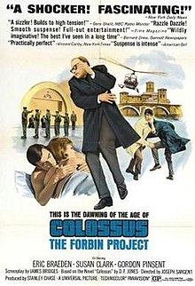

- [THE QUESTOR TAPES](https://www.youtube.com/watch?v=Oy9XCtAkNEM&list=PLQqiaRaQWB8Qq_VI6mSrmtRiOW5jx-ry-)

---

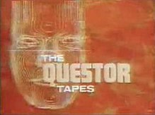

- [Demon Seed (1977) [Trailer]](https://www.youtube.com/watch?v=b4jWyyhyxSg)

---

- [Blade Runner (1982) Official Trailer - Ridley Scott, Harrison Ford Movie](https://www.youtube.com/watch?v=eogpIG53Cis)

---

.png>)

- ## [Tron](https://www.youtube.com/watch?v=Sctu7IU1OBY)

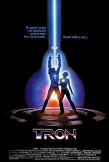

- - [More A.I movies](https://en.wikipedia.org/wiki/List_of_films_about_computers)

---

- [Lucy TRAILER 1 (2014) - Luc Besson, Scarlett Johansson Movie HD](https://www.youtube.com/watch?v=MVt32qoyhi0&t=25s)

---

- [Transcendence Official Trailer #1 (2014) - Johnny Depp Sci-Fi Movie HD](https://www.youtube.com/watch?v=VCTen3-B8GU)

---

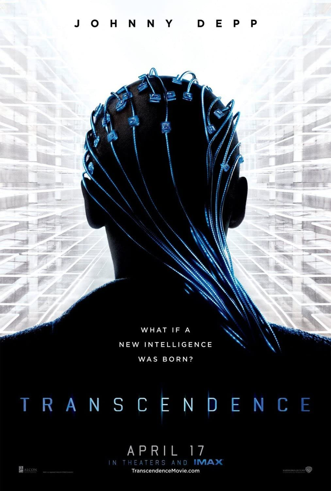

---

- [Her Trailer 1 (2013)](https://www.youtube.com/watch?v=6QRvTv_tpw0)

---

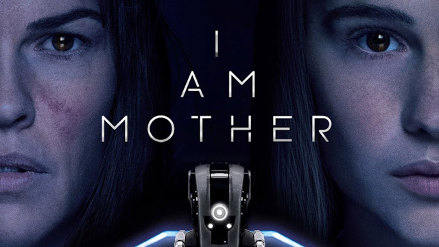

- [I Am Mother Official Trailer](https://www.youtube.com/watch?v=N5BKctcZxrM)

---

> **Computers**
>
> > Motion picture

- [Desk Set (1957)](<https://www.youtube.com/results?search_query=desk+set+(1957)>))

---

- [The Honeymoon Machine (1961)](<https://www.youtube.com/results?search_query=alphaville+(1965)>)

---

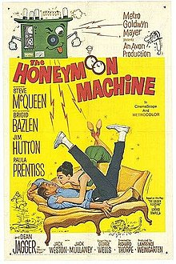

- [Alphaville (1965)]()

---

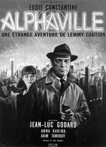

- [Billion Dollar Brain ](https://www.youtube.com/results?search_query=billion+dollar+brain)

---

- [The Andromeda Strain (1971)](<https://www.youtube.com/results?search_query=the+andromeda+strain+(1971)+trailer>)

---

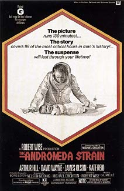

- [Revenge of the Nerds (1984)](<https://www.youtube.com/results?search_query=revenge+of+the+nerds+(1984)>)

---

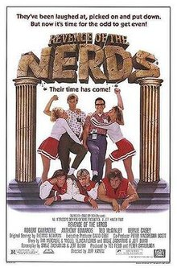

---

---

> **Hacking**

---

> 

## [ Who Am I - No System Is Safe Official Trailer #1 (2014) - Tom Schilling Thriller HD ](https://www.youtube.com/watch?v=5vnjheCqRIs)

---

> **Biography**

- [Snowden | Official Trailer [HD] | Open Road Films](https://www.youtube.com/watch?v=QlSAiI3xMh4)

---

> > Motion picture

- [The Italian Job (1969)](<https://www.youtube.com/results?search_query=The+Italian+Job+(1969)>)

---

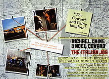

- [WarGames (1983) ](<https://www.youtube.com/results?search_query=wargames+(1983)+trailer>)

---

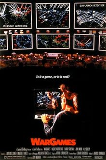

- [IMSAI 8080](https://www.youtube.com/results?search_query=IMSAI+8080+)

---

- [The Net (1995 film)](<https://www.youtube.com/results?search_query=the+net+(1995+film)>)

---

- [Ferris Bueller's Day Off (1986)](<https://www.youtube.com/results?search_query=Ferris+Bueller%27s+Day+Off+(1986)>)

---

- - [`More` Hacking movies](https://en.wikipedia.org/wiki/List_of_films_about_computers)
  ***

---

> ## DOCUMENTARIES
>
> > **A.I (Artificial Intelligence)**

- [ The Making of ELITE (Computer Videogame) ](https://www.youtube.com/watch?v=GpWoF5uVgbA)

---

- [ Mini-Docs for Developers by `HoneyPot`](https://www.youtube.com/playlist?list=PLtEPUaeDclktnuAOjeCYhEOnEqeOlt4Nq)

---

- [The Internet's Own Boy: The Story of Aaron Swartz](https://www.youtube.com/watch?v=9vz06QO3UkQ)

---

- [The brilliant mind of Hollywood legend Hedy Lamarr](https://www.youtube.com/watch?v=_rlXHNeQD-s)

---

> ## TALKS

- [DEF CON 18 - Moxie Marlinspike - Changing Threats To Privacy: From TIA to Google](https://www.youtube.com/watch?v=DoeNbZlxfUM)
